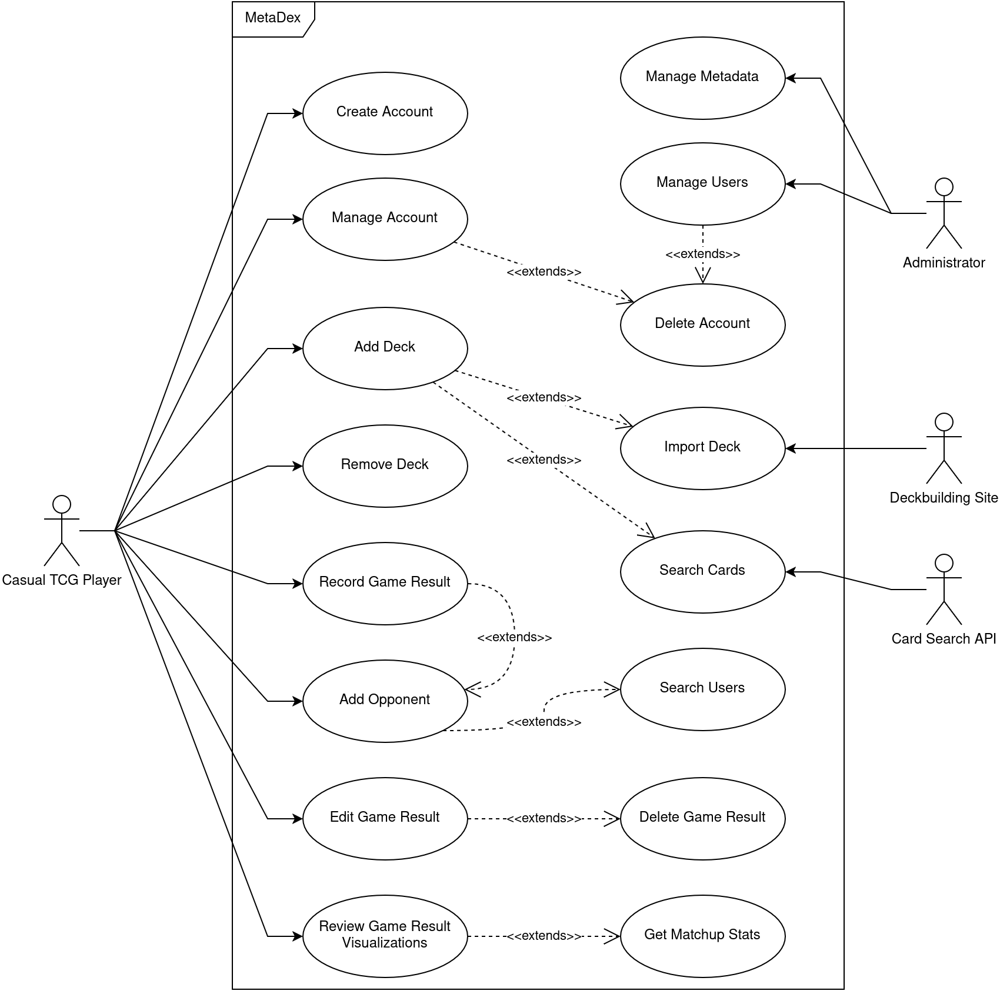
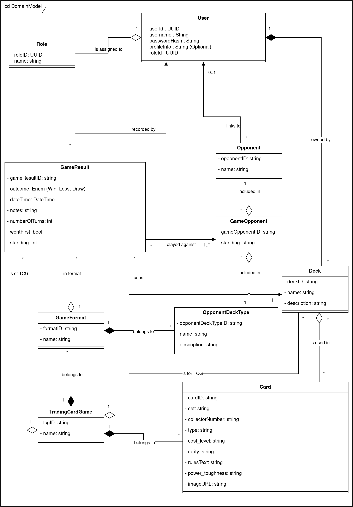
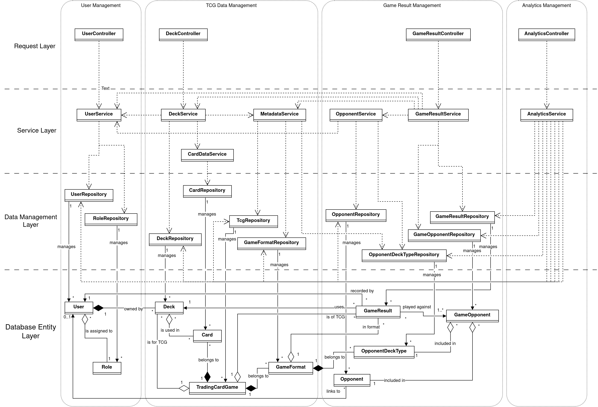
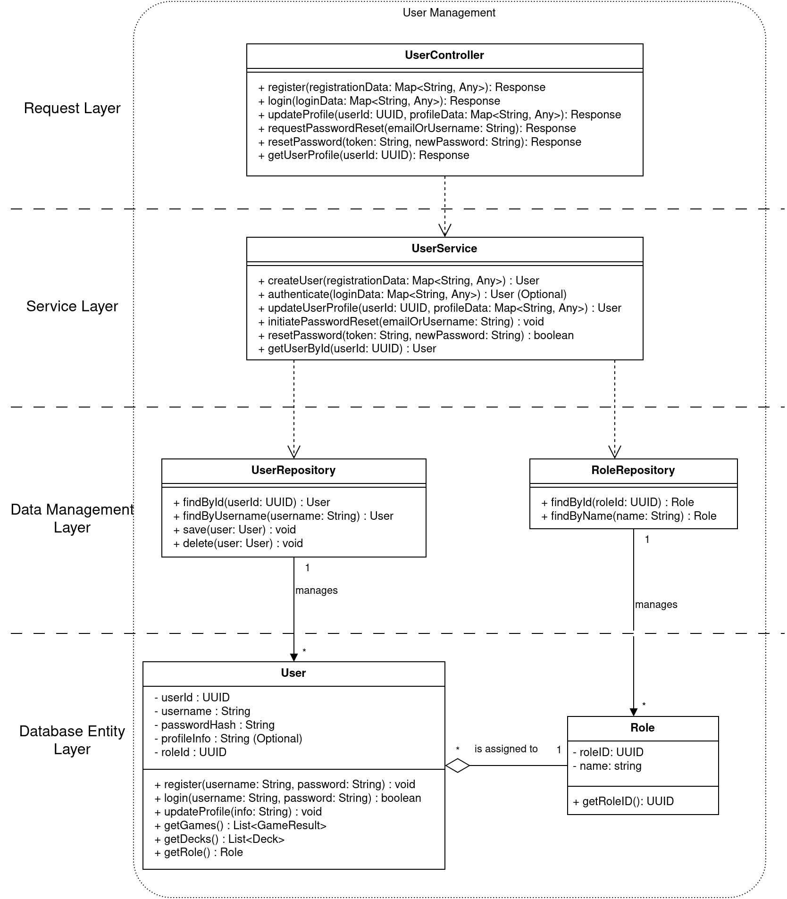
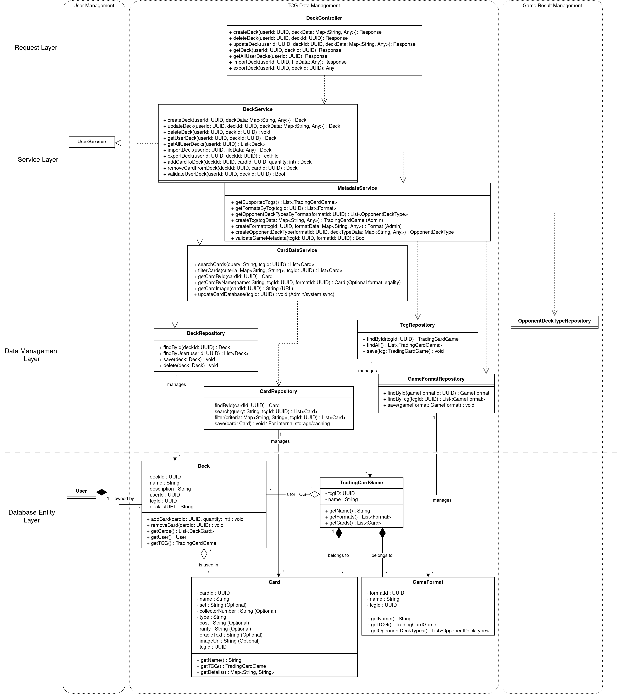
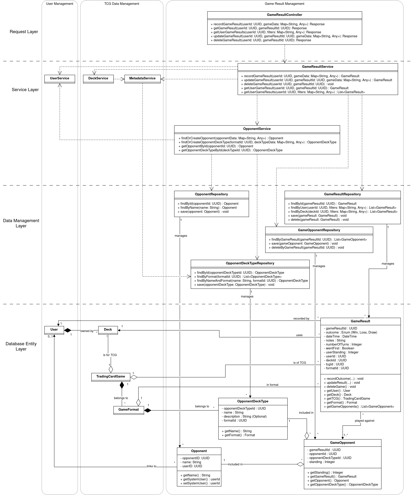
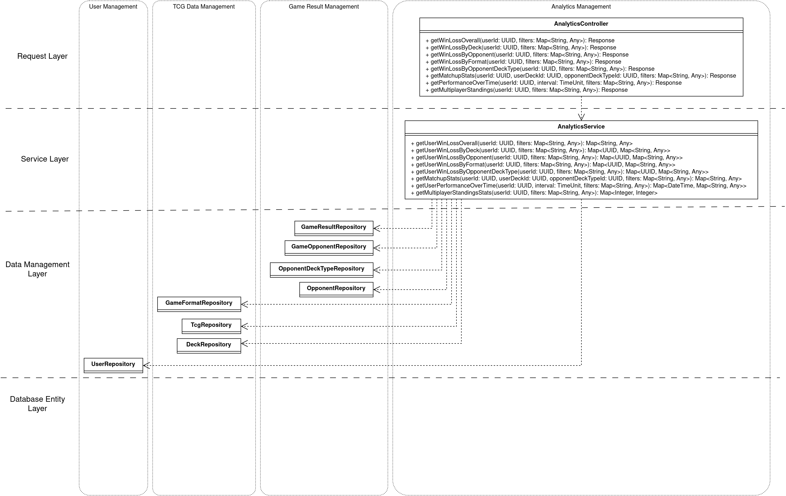

# MetaDex - TCG Game Tracker

## Mission Statement
The goal of this project is to provide a simple way for players of trading card games to track their game outcomes, and then use that data to provide those users meaningful visualizations of the data, to help them improve over time.

## Problem Statement 

Fans of trading card games have many useful tools at their disposal today. They have online storefronts where they can order any card that exists, card search engines, deck building tools, and endless articles describing specific strategies. However, there is currently a gap in services when it comes to tracking game outcomes at a casual play level. Currently, players who desire to track their win/loss rate must write their game results down on paper or create their own custom tracking spreadsheet. This lack of data infrastructure causes players to make bad decisions both during games, and also when purchasing cards. With no central database of game results to reference, players have limited information available when deciding which strategy to invest their hard-earned money in. Currently, due to the state of the industry, players make decisions based on the results posted by professionals, which may lead to vastly different outcomes at a casual play level. A software solution to this problem must provide a quick, intuitive, and reliable way to record game results, while storing that data in a scalable, filterable database. Then the solution must provide clear visualizations of the stored game results data back to users. The system should also connect with other services which are already well adopted by the trading card game community, as that will make using this new tool as seamless as possible for users. 

## Requirements

### 1. Functional Requirements

- 1.1. User Management
    - 1.1.1. The system shall provide a way for users to create an account.
    - 1.1.2. The system shall provide authentication services to support user account log in.
    - 1.1.3. The system shall allow users to update their profile information.
- 1.2. Game Result Recording
    - 1.2.1. The system shall allow users to record game outcomes.
    - 1.2.2. The system shall support multiple different trading card games (including Magic: The Gathering, Pokemon, and YuGiOh)
    - 1.2.3. The system shall allow users to record which opponent each game result was played against.
    - 1.2.4. The system shall allow users to record which strategy the opponent was playing for each game result.
    - 1.2.5. The system shall allow users to specify the format of the game played. (for example MTG has Modern, Standard, and Commander formats, each of which have different rules)
    - 1.2.6. The system shall allow users to record if they went first or second for each game result.
    - 1.2.7 The system ehall allow users to record which deck they played for each game result.
- 1.3. Data Management
    - 1.3.1. The system shall store game results in a database.
    - 1.3.2. The system shall allow users to search, edit, and delete their previously recorded game results.
    - 1.3.3. The system shall provide complex filtering capabilities, allowing users to filter their records based on TCG, format, decks, opponents, strategies, etc.
- 1.4. Data Visualization and Reports
    - 1.4.1. The system shall provide visualizations of game outcome data based on recorded game outcomes.
    - 1.4.2. The system shall provide the capability to filter data visualizations based on user defined criteria.
    - 1.4.3. The system shall provide rankings of each of the user's decks, allowing them to see how each deck has performed relative to the others.
    - 1.4.3. The system shall provide visualization and data for specific matchups for each deck, allowing the user to see where their decks could use improvement.
    - 1.4.3. The system shall provide visualizations of win/loss rates over time.
- 1.5. Deck Management
    - 1.5.1. The system shall allow users to create and track different decks within their profile.
    - 1.5.2. The system shall allow users to link to their decklist for each deck from an external site.
    - 1.5.3. The system shall allow users the option to maintain their decklist in the system, allowing them to track changes and notes over time.
    - 1.5.4. The system shall interface with popular deckbuilding websites like Moxfield and Archidekt to import user decklists and track changes.
- 1.6. Opponent Management
    - 1.6.1. The system shall allow users to save a list of individual opponents who they wish to track their games against.
    - 1.6.2. The system shall allow users to associate a tracked opponent with another user account in the system.
- 1.7. TCG Data Handling
    - 1.7.1. The system shall allow administrators to maintain a list of TCGs.
    - 1.7.2. The system shall maintain a database of cards for each supported TCG.
    - 1.7.3. The system shall allow administrators to maintain an up to date list of common formats for each TCG.

### 2. Non-Functional Requirements

- 2.1. Usability
    - 2.1.1. The system shall provide an intuitive user interface.
    - 2.1.2. The system shall provide a quick process for recording game results with minimal input requirements.
    - 2.1.3. The system shall support common display devices like phones, tablets, and web browsers.
- 2.2. Reliability
    - 2.2.1. The system shall reliably store all user entered data without losing anything.
    - 2.2.2. The system shall operate with minimal downtime, remaining available for users 99.999% of the time.
- 2.3. Performance
    - 2.3.1. The process of recording a game result shall respond to user input quickly.
    - 2.3.2. The system shall find and display game result data and visualizations in a timely manner.
- 2.4. Scalability
    - 2.3.1. The system shall be designed to support growth in user count, as well as data storage.
- 2.5. Security
    - 2.5.1. The system shall protect user accounts and user data from unauthorized access.
    - 2.5.2. The system shall employ secure methods for user authorization.
- 2.6. Maintainability
    - 2.6.1. The system shall be designed and built in a way that enables maintainability and growth in the future.
- 2.7. Compatibility
    - 2.7.1. The system shall be compatible with common operating systems for PCs and Mobile Phones.
    - 2.7.2. The system shall support compatibility with common web browsers.

## UML Diagrams

### Use Case Diagram

Main customer facing Use Cases cover user account, deck, opponent, and game result management, as well as game result visualization.

These use cases are supported by system administrators, as well as external APIs for obtaining deck and card data.

### Domain Model

### Design Class Diagram
Since this system is mostly about data management and data visualization, it is broken down into multiple layers to simplify the maintenance, and access of all the different data types.

The layers are as follows:
- Request Layer - Handles incoming API calls, and formats responses before sending. Contains no core business logic.
- Service Layer - These classes handle the core business logic. They are the controller classes for the entire system. This is where use case functionality is maintained.
- Data Management Layer - The classes in this layer handle data retrieval and maintenance operations. They provide functions to save system data to the database, and return objects back to the service layer to support business goals.
- Database Entity Layer - These are the domain based classes that are passed around between the above layers to achieve business goals. They represent real world objects or concepts, and are instantiated by the Data Management Layer Classes based on information stored in the system database.

The following Domain Class diagram is split into multiple views due to the large number of classes.

#### User Management View

#### TCG Data Management View

#### Game Result Management View

#### Analytics Management View

### 